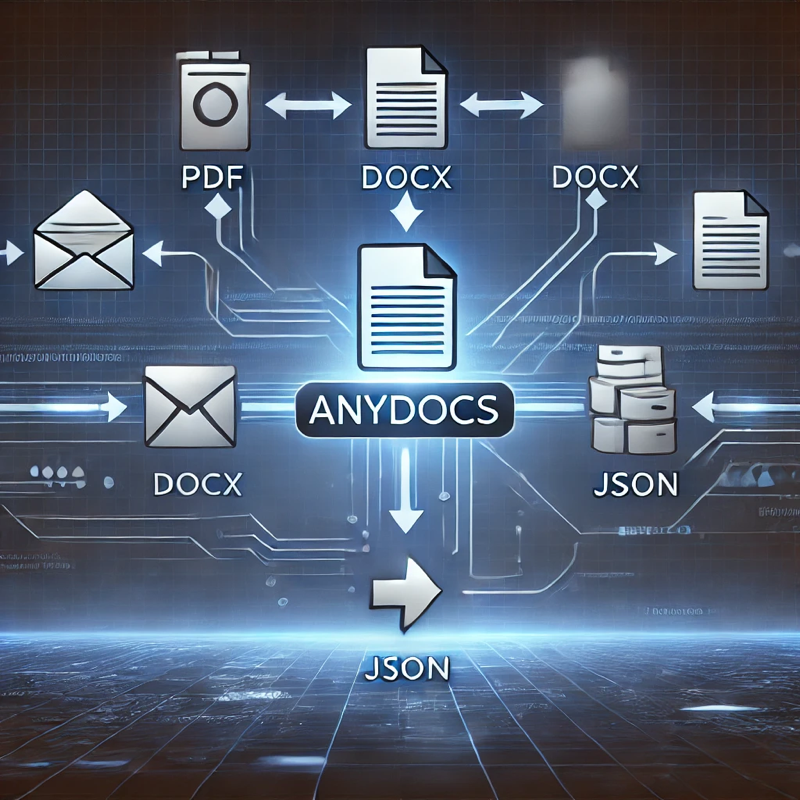

# AnyDocs



## Introduction

**AnyDocs** is a powerful and flexible document loader designed to process various file formats efficiently. Whether loading from local file paths, URLs, or HTTP responses, AnyDocs provides a seamless experience for content extraction and document processing.

## Features

- **Multi-format Support**: Supports DOCX, PDF, PPTX, XLSX, JSON, Markdown, HTML, CSS, JS, and more.
- **Flexible Loading**: Load documents from local files, URLs, or raw text content.
- **Asynchronous Capabilities**: Supports efficient async document processing.
- **Extensible**: Easily add support for new file formats with custom loaders.
- **Streaming Extraction**: Process documents in chunks for optimized performance.

## Installation

Install **AnyDocs** via pip:

```sh
pip install anydocs git+https://github.com/bahamondex/anydocs.git
```

## Usage

### Basic Usage

Extract content from a document with `load_document`:

```python
from anydocs import load_document

# Load from a file
for chunk in load_document("path/to/your/document.docx"):
    print(chunk)

# Load from a URL
for chunk in load_document("https://example.com/document.pdf"):
    print(chunk)
```

### Advanced Usage

For more control, use the `AnyDocs` class directly:

```python
from anydocs import AnyDocs

# Load using AnyDocs class
loader = AnyDocs.load("path/to/your/document.docx")
for chunk in loader:
    print(chunk)
```

## Supported File Types

AnyDocs supports the following formats:

- **DOCX** – Word documents
- **PDF** – Portable Document Format
- **PPTX** – PowerPoint presentations
- **XLSX** – Excel spreadsheets
- **JSON** – JSON files
- **Markdown** – Markdown files
- **HTML** – HTML files
- **CSS** – Cascading Style Sheets
- **JS** – JavaScript files

## Custom Loaders

Extend **AnyDocs** by defining a custom loader:

```python
from anydocs._base import Artifact

class CustomLoader(Artifact):
    def extract(self):
        # Custom extraction logic
        yield "Extracted content"

# Register the custom loader
AnyDocs.loaders[".custom"] = CustomLoader
```

## Performance & Scalability

- **Chunk-based Processing**: Allows large documents to be processed incrementally.
- **Asynchronous Execution**: Optimized for non-blocking workflows.
- **Modular Architecture**: Easily integrates into different applications.

## Contributing

We welcome contributions! Please follow these steps:

1. Fork the repository.
2. Create a feature branch (`feature/new-loader`).
3. Implement and test your changes.
4. Submit a Pull Request.

## License

AnyDocs is licensed under the **MIT License**.

## Contact

For support, contact **oscar.bahamonde.dev@gmail.com** or visit our [GitHub Repository](https://github.com/bahamondex/anydocs).

---

**AnyDocs – Seamless Document Processing Made Easy!**
