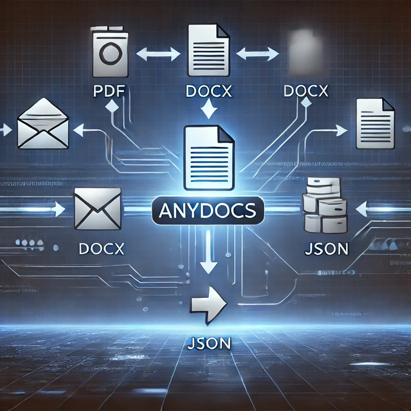

# AnyDocs



AnyDocs is a versatile document loading library for Python that simplifies working with multiple document formats through a unified API. Load and extract content from local files, URLs, or raw text with automatic format detection.

## Features

- **Multi-format Support**: DOCX, PDF, PPTX, XLSX, CSV, HTML, Markdown, XML, RTF, and more
- **Smart Format Detection**: Automatically identifies document types by extension, MIME type, or content
- **Flexible Sources**: Process documents from file paths, URLs, or uploaded files
- **Streaming Architecture**: Memory-efficient processing with generator-based extraction
- **HTML Cleanup**: Option to extract plain text only from HTML-formatted content
- **Extensible Framework**: Easy registration of custom document loaders

## Installation

```bash
pip install anydocs
```

## Quick Usage

```python
from anydocs import load_document

# Load document from file path
for chunk in load_document("document.pdf"):
    print(chunk)

# Load document from URL
for chunk in load_document("https://example.com/report.docx"):
    print(chunk)

# Extract plain text only (removes HTML formatting)
for chunk in load_document("webpage.html", extract_text_only=True):
    print(chunk)
```

## Supported File Types

| Extension | Document Type |
|-----------|---------------|
| .docx, .doc | Word Documents |
| .pdf | PDF Documents |
| .pptx, .ppt | PowerPoint Presentations |
| .xlsx, .xls | Excel Spreadsheets |
| .csv | CSV Files |
| .html, .htm | HTML Documents |
| .md, .txt | Markdown/Text Files |
| .xml | XML Documents |
| .jsonl, .json | JSON/JSONL Files |
| .rtf | Rich Text Format |

## License

MIT License

## Contact

GitHub: [https://github.com/bahamondex/anydocs](https://github.com/bahamondex/anydocs)  
Email: oscar.bahamonde.dev@gmail.com